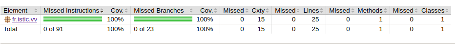
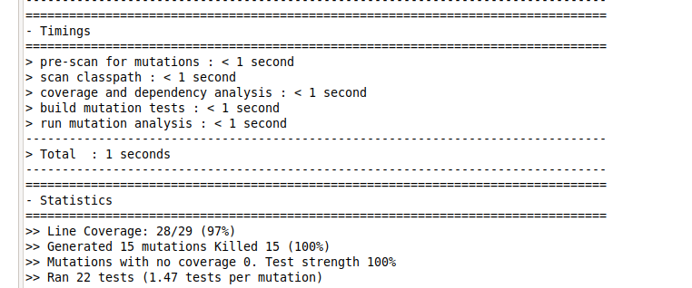

# Balanced strings

A string containing grouping symbols `{}[]()` is said to be balanced if every open symbol `{[(` has a matching closed symbol `]}` and the substrings before, after and between each pair of symbols is also balanced. The empty string is considered as balanced.

For example: `{[][]}({})` is balanced, while `][`, `([)]`, `{`, `{(}{}` are not.

Implement the following method:

```java
public static boolean isBalanced(String str) {
    ...
}
```

`isBalanced` returns `true` if `str` is balanced according to the rules explained above. Otherwise, it returns `false`.

Use the coverage criteria studied in classes as follows:

1. Use input space partitioning to design an initial set of inputs. Explain below the characteristics and partition blocks you identified.
2. Evaluate the statement coverage of the test cases designed in the previous step. If needed, add new test cases to increase the coverage. Describe below what you did in this step.
3. If you have in your code any predicate that uses more than two boolean operators check if the test cases written so far satisfy *Base Choice Coverage*. If needed add new test cases. Describe below how you evaluated the logic coverage and the new test cases you added.
4. Use PIT to evaluate the test suite you have so far. Describe below the mutation score and the live mutants. Add new test cases or refactor the existing ones to achieve a high mutation score.

Write below the actions you took on each step and the results you obtained.
Use the project in [tp3-balanced-strings](../code/tp3-balanced-strings) to complete this exercise.

## Answer (Louis-Gabriel CAPLIEZ et Valère BILLAUD, ESIR2 Spé INFO, option SI)

Pour l’exercice *Balanced String* nous avont découpé l’ensemble d’entré en plusieurs sous ensembles :
- L’ensemble des chaînes de caractères qui n’ont pas autant d’ouvert ‘‘(‘’ (Resp : ‘’[‘’ et ‘’{‘’) que de fermé ‘’)’’ (Resp : ‘’]’’ et ‘’}’’).
- L’ensemble des String qui ont autant d’ouvert que de fermé et commencent par un fermé ‘’)’’ ou ‘’]’’ ou ‘’}’’. 
- L’ensemble des String qui ont autant d’ouvert que de fermé, qui commencent et terminent par un ouvert.
- L’ensemble des String qui ont autant d’ouvert que de fermé, qui commencent et terminent par un ouvert et un fermé. De plus ils possèdent au moins un ouvert suivi (modulo des caractères alphanumériques différents de ‘’()[]{}’’  ) d’un fermé de type différent (ex : ‘’( ]’’, ‘‘[ }’’, ‘’{ )’’).
- L’ensemble des String qui ont autant d’ouvert que de fermé, qui commencent et terminent par un ouvert et un fermé. De plus ils ne possèdent pas un ouvert suivi (modulo des caractères alphanumériques différents de ‘’()[]{}’’  ) d’un fermé de type différent (ex : ‘’( ]’’, ‘‘[ }’’, ‘’{ )’’).

Après avoir utilisé Jacoco nous avons remarqué que des instructions ainsi que des branches n’étaient pas testés. 
- Comme pour nous le ‘(‘, ‘[‘ et ‘{‘ ont des rôles symétriques nous avions oublié de tester le fait d’avoir un fermé ‘]’ et ‘}’ alors qu’il n’y avait rien d’ouvert.
- De plus nous avions oublié de tester les exemples avec des caractères différents entre les parenthèses.



Après avoir rajouté les tests expliqués ci-dessus, nous obtenons une couverture de 100 %.



A l’aide de PIT nous avons pu déterminer la confiance que nous pouvons porter à nos tests. Sur 15 mutants créés, tous sont morts, ce qui nous permet de dire que nous avons une confiance établie en nos testes.
