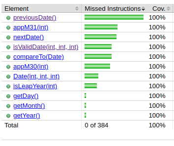
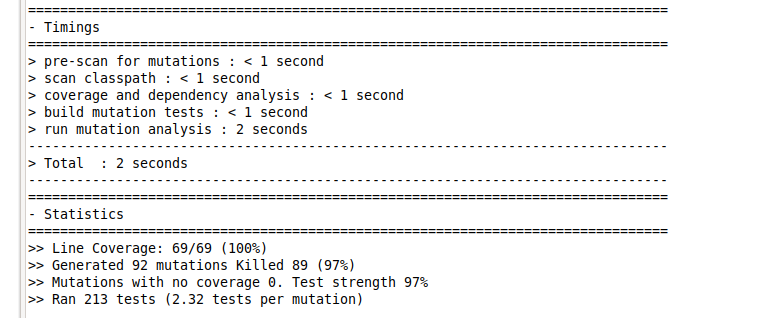

# Test the Date class

Implement a class `Date` with the interface shown below:

```java
class Date implements Comparable<Date> {

    public Date(int day, int month, int year) { ... }

    public static boolean isValidDate(int day, int month, int year) { ... }

    public static boolean isLeapYear(int year) { ... }

    public Date nextDate() { ... }

    public Date previousDate { ... }

    public int compareTo(Date other) { ... }

}
```

The constructor throws an exception if the three given integers do not form a valid date.

`isValidDate` returns `true` if the three integers form a valid year, otherwise `false`.

`isLeapYear` says if the given integer is a leap year.

`nextDate` returns a new `Date` instance representing the date of the following day.

`previousDate` returns a new `Date` instance representing the date of the previous day.

`compareTo` follows the `Comparable` convention:

* `date.compareTo(other)` returns a positive integer if `date` is posterior to `other`
* `date.compareTo(other)` returns a negative integer if `date` is anterior to `other`
* `date.compareTo(other)` returns `0` if `date` and `other` represent the same date.
* the method throws a `NullPointerException` if `other` is `null` 

Design and implement a test suite for this `Date` class.
You may use the test cases discussed in classes as a starting point. 
Also, feel free to add any extra method you may need to the `Date` class.


Use the following steps to design the test suite:

1. With the help of *Input Space Partitioning* design a set of initial test inputs for each method. Write below the characteristics and blocks you identified for each method. Specify which characteristics are common to more than one method.
2. Evaluate the statement coverage of the test cases designed in the previous step. If needed, add new test cases to increase the coverage. Describe below what you did in this step.
3. If you have in your code any predicate that uses more than two boolean operators check if the test cases written to far satisfy *Base Choice Coverage*. If needed add new test cases. Describe below how you evaluated the logic coverage and the new test cases you added.
4. Use PIT to evaluate the test suite you have so far. Describe below the mutation score and the live mutants. Add new test cases or refactor the existing ones to achieve a high mutation score.

Use the project in [tp3-date](../code/tp3-date) to complete this exercise.

## Answer (Louis-Gabriel CAPLIEZ et Valère BILLAUD, ESIR2 Spé INFO, option SI)

Nous avons choisi de suivre la norme [ISO 8601](https://fr.wikipedia.org/wiki/ISO_8601) pour cette exercice, nous avons donc l’an 0 qui existe en plus des normes pour les dates du calendrier grégorien.

Nous avons dans un premier temps testé la méthode *isLeapYear()*.  

Nous avons partitionné l’ensemble des *Integer* en 4 sous-ensembles : 
- Les multiples de 400 qui représentent une année bissextile et donc doivent renvoyer *true*.
- Les multiples de 100 privés des multiples de 400 qui ne sont pas une année bissextile et donc doivent renvoyer *false*.
- Les multiples de 4 qui ne sont pas multiples de 100 qui représentent une année bissextile et donc doivent renvoyer *true*.
- Ceux qui ne sont pas multiple de 4, qui ne sont donc pas une année bissextile et doivent renvoyer *false*.

Après avoir testé la méthode *isLeapYear()* nous pouvons testé la méthode *isValidDate()* qui dépend de la méthode précédente. 

Nous partitionnons l’entrée d’un triplé de 3 *Integer (j, m, a)* comme suit : 
- j ∉ [1,31], m ∉ [1,12], a quelconque qui est une date invalide.
- j ∈ [1,31], m ∈ {1,3,5,7,8,10,12}, a quelconque qui est une date valide.
- j = 31 , m ∈ {2,4,6,9,11}, a quelconque qui est une date invalide.
- j ∈ [1,30], m ∈ {4,6,9,11}, a quelconque qui est une date valide.
- j = 30 , m = 2, a quelconque qui est une date invalide.
- j  ∈ [1,29] , m = 2, *isLeapYear(a)= true* qui est une date valide.
- j  ∈ [1,28] , m = 2, *isLeapYear(a) = false* qui est une date valide.
- j  = 29 , m = 2, *isLeapYear(a) = false* qui est une date invalide.

Maintenant la méthode *isValidDate()* est testée et le constructeur renvoie bien une exception lorsque la date est invalide pour pouvoir de tester les méthodes qui ont besoin de *Date*. 

Nous testons la méthode *compareTo()*.
Nous partitionnons l’entrée qui est deux triplés représentant les attributs des deux *Date* à comparer que nous nommerons *date1 = (j1,m1,a1)* et *date2 = (j2,m2,a2)* :
- L’ensemble des sextuples où a1 > a2, date1 > date2 donc renvoie 1.
- L’ensemble des sextuples où a1 < a2, date1 < date2 donc renvoie -1.
- L’ensemble des sextuples où a1 = a2 et m1 > m2 , date1 > date2 donc renvoie 1. 
- L’ensemble des sextuples où a1 = a2 et m1 < m2, date1 < date2 donc renvoie -1.  
- L’ensemble des sextuples où a1 = a2 et m1 = m2 et j1 > j2, date1 > date2 donc renvoie 1. 
- L’ensemble des sextuples où a1 = a2 et m1 = m2 et j1 < j2, date1 < date2 donc renvoie -1. 
- L’ensemble des sextuples où a1 = a2 et m1 = m2 et j1 = j2, date1 = date2 donc renvoie 0.

Nous avons maintenant une méthode qui permet de comparer deux dates testée. Nous pouvons donc l’utiliser par la suite. 

Nous testons maintenant la méthode *nextDate()*.
Nous partitionnons l’entrée d’une *date = (j, m, a)* en 3 sous-ensembles : 
- Il reste au moins 1 jour avant la fin du mois.
- Nous sommes le dernier jour du mois, mais il reste un mois avant la fin de l’année.
- Nous sommes le dernier jour de l’année.

Nous testons maintenant la méthode *previousDate()*.
Nous partitionnons l’entrée *date = (j, m , a)* en 7 sous-ensembles :
- Nous ne sommes pas le premier jour du mois. 
- Nous sommes le premier jour d’un mois qui succède à un mois de 31 jours.
- Nous sommes le premier jour d’un mois qui succède à un mois de 30 jours. 
- Nous sommes le premier jour du mois de Mars d’une année bissextile. 
- Nous sommes le premier jour du mois de Mars d’une année qui n’est pas bissextile. 
- Nous sommes le premier jour d’une année.



Nous avons tester la couverture de nos tests avec Jacoco et comme vue sur l’image ci-dessus, nos tests passent par toutes les lignes du programme. 

Dans la méthode *isValideDate()* nous avons un *if* dont la condition est *(month < 13 && month > 0 && day > 0 && day < 32)*. Cependant dans les tests nous ne testions que les deuxièmes et troisième critères. Nous en avons donc rajouté un nouveau pour les critères 1 et 4.



A l’aide du programme *PIT*, nous avons pu tester la robustesse de nos tests. Il nous a généré 92 mutants dont 89 ont été tués. Ce chiffre qui nous assure une certaine confiance en nos tests, même si ils pourraient être encore améliorés. 